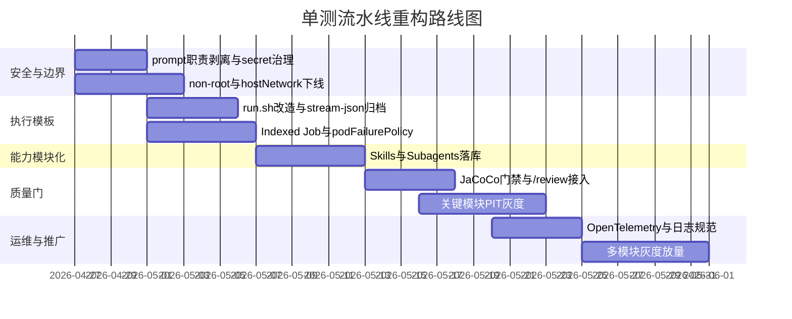

# 基于已提供 prompt.md 示例的 Qwen Code 单测流水线重构报告

## 执行摘要

你提供的用户内容并不缺失：上传的 Markdown 文稿中已经内嵌了一个 `prompt.md` 示例、一个现有 `run.sh` 草案，以及一个 Kubernetes Job 示例。我把这份内嵌示例视为当前规范基线来分析，而不是把它当作仓库里可直接读取的真实 `prompt.md` 文件。基于这份基线，当前方案最大的优点是**测试标准写得细、工程流程意识强、已经在思考批量 Job、多模块并行和版本化迭代**；最大的缺点是**职责边界严重混杂**：克隆仓库、分支控制、版本迭代、单测生成、文档更新、打 tag、推送、Issue 闭环、安全规则、并行策略，全都被塞进了一个 prompt 和一个 shell 脚本里，导致系统既难维护，也难控风险。

从官方能力对照看，最合理的重构方向不是继续把 prompt 写得更长，而是把它**拆成 Skill、Subagent、deterministic shell、Kubernetes 模板、Hooks 和质量门**。Qwen Code 官方已经明确给出几条关键能力边界：应优先从 Plan 模式开始理解任务；YOLO 仅适用于受控环境中的可信自动化；Headless 支持结构化输出、`stream-json`、session 恢复和一致退出码；Skill 适合封装可发现的专业能力；Subagent 适合做隔离上下文和受控工具访问；`/review` 自带确定性分析和并行审查 agent。Kubernetes 官方文档则已经为批处理提供了 Indexed Job、`activeDeadlineSeconds`、`ttlSecondsAfterFinished`、`podFailurePolicy`、Secret、ConfigMap 投射以及 Pod 安全基线。citeturn8view6turn8view8turn8view4turn8view5turn8view9turn8view0turn7view8turn17view0turn7view10turn7view11turn13view1turn12search1

因此，本报告的核心结论是：**把“AI 该思考的事”和“系统必须确定执行的事”彻底分开**。仓库克隆、证书、分支切换、索引映射、构建/测试、结果归档、提交与打 tag 应从 prompt 中抽离，交给 `run.sh` 和 Kubernetes；而方法筛选、测试设计、测试代码生成、文档同步、团队规范审查，则交给拆分后的 Skills 与 Subagents。这样做的直接收益是：一套 YAML 仍然可以覆盖“一个 YAML 搞定”的产品目标，但安全边界、失败语义、可观测性和规模化并发都会比原稿高一个等级。citeturn8view8turn18view0turn15view1turn24view0turn24view2turn8view0turn7view8turn20view0

## 输入内容与责任提炼

此次分析基于你上传文稿中的三类内容：

1. 一个现有运行入口：`qwen --debug --output-format stream-json --yolo -p "工作目录为..., ${ISC_CLAUDE_CODE_PROMPT}"`
2. 一个外层任务 prompt 示例：负责 HTTP 克隆仓库、执行 `prompt.md`、鼓励 `sudo`
3. 一个内嵌 `prompt.md` 示例：负责单测规范、版本规划、文档维护、Git 规范、版本/tag、Issue 闭环等

这意味着当前的“prompt.md”并不是一个单纯的“测试提示词文件”，而是一个**混合了产品规范、研发流程、发布流程、安全边界和测试方法论**的超级指令文件。它已经不是普通 prompt 的复杂度，而更像一份“人工写成的微型流水线控制器”。

### 明确假设

| 项目 | 本报告采用的假设 | 影响 |
|---|---|---|
| 用户内容是否存在 | 存在；但 `prompt.md` 是以上传 Markdown 内嵌示例的形式提供，而非独立原文件 | 本报告以该示例为“当前规范基线” |
| 仓库真实结构 | 未提供实际仓库目录树与真实模块清单 | 模块名、路径白名单、PIT 目标类规则以模板化方式给出 |
| 集群版本 | 推荐假设 Kubernetes ≥ 1.33；至少 ≥ 1.31 | 这样才能稳定使用 `backoffLimitPerIndex` 与稳定版 `podFailurePolicy` |
| Qwen 版本 | 假设所用 CLI 已具备当前官方文档中的 Headless、Skills、Subagents、Hooks、`/review` | 若版本落后，需要降级模板 |
| 模型接入协议 | 假设 GLM5 通过 OpenAI 兼容接口接入 | 使用 `OPENAI_*` 环境变量与 `modelProviders.openai` 模板 |
| 证书处理 | 假设企业 CA 证书可通过镜像预烘焙或 initContainer/卷注入 | 这样主容器才能摆脱 root + sudo |
| Git 发布策略 | 默认允许提交/打 tag/推送，但改为“质量门通过后由 shell 执行” | 不再把发布动作作为 AI 自由决定的一部分 |

Kubernetes 官方说明，`podFailurePolicy` 在 v1.31 已稳定，而 `backoffLimitPerIndex` 在 v1.33 进阶为 GA；如果你的集群比这更老，就不能直接照搬本文的 Job 模板，需要降级成多个 Job 或只用全局 `backoffLimit`。citeturn7view8turn17view0

### 从原稿抽出的全部职责

| 责任簇 | 原稿里的代表性要求 | 建议最终落位 |
|---|---|---|
| 仓库初始化 | HTTP 克隆、重试 10 次、禁止 SSH | `run.sh` |
| 权限与安全 | 鼓励 sudo、自动批准、不能改 prompt、不能泄密 | `repo-guard` Skill + Hooks + 非 root 容器 |
| 模块作用域 | 仅为指定模块写 UT | `repo-guard` + `ut-planner` |
| 测试设计 | JUnit5、Mockito、AssertJ、`jakarta.*`、正常/异常/边界/null/verify/ArgumentCaptor | `ut-writer` + `ut-reviewer` |
| 任务拆解 | 扫描复杂 Service、挑选高价值方法、版本规划、难点说明 | `ut-planner` |
| 代码修改范围 | 禁改 `src/main/java`、优先新建测试类、已有 UT 仅在必要时改 | `repo-guard` + `ut-writer` |
| 构建验证 | `mvn clean package ...`、单测通过 | shell / 构建阶段 |
| 并行执行 | 鼓励 subagent 或并行模式 | `ut-planner` + Subagent 配置 |
| Git 工作流 | 固定 dev 分支、commit 规范、禁止 AI 痕迹 | shell + `release-gate` |
| 发布动作 | 创建 Git Tag 并推送 | `release-gate` + shell |
| 文档同步 | 更新 `plan.md`、`README.md`、`issues.md` | `doc-sync` |
| 质量审查 | 高复杂度覆盖、最小化改动、中文注释/日志 | `ut-reviewer` + `/review` |

### 当前项与优化项对照

| 当前项 | 主要问题 | 优化项 |
|---|---|---|
| 外层 prompt 负责仓库克隆 | AI 不该决定传输协议、重试策略和认证细节 | 改为 shell 负责 `git clone/fetch/checkout` |
| 单一 `prompt.md` 承担所有职责 | 可维护性差，难以复用与审计 | 拆成多个 Skills，再配少量 deterministic shell |
| 全局 `--yolo` | 风险过大，权限过宽 | Plan 阶段只读；写测试用 `auto_edit`；`/review` 在受控环境下窄化使用 YOLO |
| `2>&1` 混流 + `|| true` | `stream-json` 被污染，失败被吞掉 | stdout/stderr 分离；结构化结果解析；统一退出码 |
| root + `sudo` + `hostNetwork: true` | 明显偏离 K8s 安全基线 | non-root、禁止提权、`RuntimeDefault`、关闭宿主网络 |
| 明文模型凭据 | 泄漏风险高 | `secretRef` + `envKey` |
| 单文件 `subPath` 分散挂载 | 运维繁琐；热更新差 | projected volume 挂整目录到 `/skills`、`/agents` |
| AI 决定 commit/tag/push | 发布权限过大 | shell 依据质量门做确定性发布 |

Kubernetes Baseline 策略明确禁止共享宿主名字空间，其中就包括 `spec.hostNetwork`，同时 Restricted 级别要求 `allowPrivilegeEscalation=false`、`runAsNonRoot=true` 和显式的 seccomp 配置；Secret 也应专门承载敏感数据而不是混在普通配置里。citeturn13view1turn12search1turn7view10

## Skills 与 Subagents 设计

Qwen Code 官方定义里，Skill 是带有 `SKILL.md` 的可发现模块化能力，适合沉淀团队规范和重复工作流；Subagent 则是存放在 `.qwen/agents/` 或 `~/.qwen/agents/` 下的独立 Markdown 配置，具有独立上下文和受控工具访问。对于 CI/批处理来说，Skill 既可以由模型按描述自动发现，也可以显式通过 `/skills <skill-name>` 调用；这恰好适合把原来那份“大 prompt”变成若干个责任单一、可复用、可审计的能力包。citeturn18view0turn14view1turn15view1turn15view2

同时要强调一点：**官方意义上的 Subagent 不是 Kubernetes Pod/容器**，而是 Qwen 会话内部的逻辑代理配置。因此，容器镜像建议首先是给“承载 Qwen 主会话的 Job/Pod”准备的，不是给每个 Subagent 各起一个容器。若需要更强隔离，再把某些逻辑角色映射成不同 Job 模板。citeturn8view5turn15view1

### Skills 拆分建议

| Skill | 目的 | 触发短语 | 输入 | 输出 | 失败语义 | 所需权限 |
|---|---|---|---|---|---|---|
| `repo-guard` | 执行前安全与范围校验 | “先检查任务边界与禁止修改项” | 模块名、分支、Git 状态、允许路径 | guard 报告、允许写路径列表 | 发现越权、分支错误、敏感文件、越界修改即硬失败 | 只读 + `git status` |
| `ut-planner` | 为目标模块筛方法、定版本范围、更新 `plan.md` | “为模块生成单测计划” | 模块路径、复杂度候选、`plan.md/issues.md` | 候选方法清单、版本建议、计划文档草案 | 无候选方法/作用域不符即失败 | 只读 + 允许改 `plan.md` |
| `ut-writer` | 只新建/修改测试代码 | “为该计划补充单测” | 计划结果、测试规范、参考类路径 | 新 UT 文件、修改摘要 | 改到禁止路径、无新测试、编译明显失败即失败 | 读写 `src/test/java/**` |
| `ut-reviewer` | 团队级测试政策审查 | “按团队规范审查测试变更” | 测试 diff、报告、构建结果 | 发现清单、严重级别 | 关键违规即失败 | 只读 |
| `doc-sync` | 同步 `plan.md/README.md/issues.md` | “同步本次迭代文档与 issue” | 通过后的变更、覆盖/审查摘要 | 文档更新、变更记录 | 目标文件缺失可软失败；越权写入硬失败 | 仅文档写权限 |
| `release-gate` | 判断是否允许发布 | “根据质量门决定是否可提交打 tag” | build、review、coverage、mutation | `publish-allowed=true/false` | 门禁未过则失败 | 只读 |

### 推荐补充的 Subagent 角色

| Subagent | 角色 | 最小工具/权限 | 典型镜像建议 | 关键环境变量 | 关键挂载 |
|---|---|---|---|---|---|
| `planner-scout` | 只读扫描模块、方法、复杂度热点 | `read_file`, `grep_search` | 与主 runner 同镜像即可；也可调试用只读镜像 | `WORKSPACE`, `MODULE`, `RESULTS_DIR` | `/workspace`, `/skills`, `/agents`, `/results` |
| `test-writer` | 只做测试代码生成 | `read_file`, `edit`, `write_file`, `grep_search` | 主 runner 镜像；不要求独立容器 | 同上 | 同上 |
| `policy-reviewer` | 基于团队规范复核这次测试修改 | `read_file`, `grep_search` | 主 runner 镜像 | 同上 | 同上 |
| `doc-curator` | 更新 `plan.md/README.md/issues.md` | `read_file`, `edit`, `write_file`, `grep_search` | 主 runner 镜像 | 同上 | 同上 |
| `build-runner` | 可选；仅在你希望 AI 代理观察局部构建输出时启用 | `bash`, `read_file`, `grep_search` | 若真要容器隔离，可用带 JDK17/Maven 的同系镜像 | `MODULE`, `MAVEN_OPTS` | `/workspace`, `.m2`, `/results` |

Qwen 路线图与 Hook 文档里能看到当前常见工具 ID 形态，例如 `bash`、`read_file`、`write_file`、`edit`、`grep_search`；如果你本地 CLI 输出的工具 ID 名称不同，应以实际版本为准映射。citeturn19view0turn24view3

### Skills 的 ConfigMap 示例

下面的 YAML 不是“唯一正确写法”，但已经是能直接落地的、足够具体的项目级 Skill 配置。注意这里把 Skill 内容放进 ConfigMap，然后在运行时复制到工作区 `.qwen/skills/`。

```yaml
apiVersion: v1
kind: ConfigMap
metadata:
  name: skill-repo-guard
data:
  SKILL.md: |-
    ---
    name: repo-guard
    description: 在 Java UT 批处理开始前执行仓库范围和安全检查。用于“限制模块、禁止修改主代码、检查 dev 分支、检查密钥泄漏、检查 prompt 保护”场景。
    ---
    # Repo Guard
    你是仓库安全与范围守卫。
    必须检查：
    - 当前任务是否只针对指定模块。
    - 当前分支是否为 dev。
    - 是否试图修改 prompt.md、src/main/java/**、.env、证书、密钥文件。
    - 是否有敏感内容被加入 git 暂存区。
    - 是否存在越权修改 README/plan/issues 之外的非测试文件。
    输出 JSON 摘要：
    - allowed: true/false
    - reasons: []
    - allowed_write_globs: []
    - blocked_paths: []

---
apiVersion: v1
kind: ConfigMap
metadata:
  name: skill-ut-planner
data:
  SKILL.md: |-
    ---
    name: ut-planner
    description: 为 Java Maven 模块规划高价值单测候选方法和迭代范围。用于“测试计划、复杂度筛选、版本范围、plan.md 更新”场景。
    ---
    # UT Planner
    你只做规划，不写测试代码。
    工作要求：
    - 扫描目标模块的 Service/Manager/Facade 等业务类。
    - 优先选择分支多、异常路径多、依赖协作多的方法。
    - 遵守：每个 MINOR 最多 5 个方法；必须至少 1 个高价值复杂方法。
    - 禁止挑选 POJO/DTO/Entity/Enum。
    - 输出候选方法、优先级、难点评估、版本类型建议。
    - 如允许，更新 plan.md 草案，但不要提交。

---
apiVersion: v1
kind: ConfigMap
metadata:
  name: skill-ut-writer
data:
  SKILL.md: |-
    ---
    name: ut-writer
    description: 依据已批准的计划为 Java 模块补充高质量单测。用于“新建测试类、完善正常/异常/边界场景、Mockito verify、ArgumentCaptor、AssertJ、jakarta 包规范”场景。
    ---
    # UT Writer
    你只允许写测试相关文件。
    强制规则：
    - 仅写 src/test/java/** 和必要的测试资源文件。
    - 禁止修改 src/main/java/**。
    - 优先新建测试类；若同名冲突，使用序号后缀。
    - 使用 JUnit 5、Mockito、AssertJ、JDK17、Spring Boot 3、jakarta.*。
    - 每个方法至少考虑：正常路径、异常路径、边界/null、关键 verify、必要时 ArgumentCaptor。
    - 所有 mock setup 上方写简体中文注释。
    - 输出新增/修改的测试文件列表与覆盖场景摘要。

---
apiVersion: v1
kind: ConfigMap
metadata:
  name: skill-ut-reviewer
data:
  SKILL.md: |-
    ---
    name: ut-reviewer
    description: 按团队单测规范审查本次测试变更。用于“检查异常断言、边界值、verify、ArgumentCaptor、中文注释、禁止越权修改”场景。
    ---
    # UT Reviewer
    你只做审查，不做写入。
    检查点：
    - 是否存在 assertThrows/异常路径。
    - 是否覆盖边界值、null、空集合。
    - 是否验证关键 mock 交互次数与参数。
    - 是否对复杂参数使用 ArgumentCaptor 或等价断言。
    - 是否误改 src/main/java/** 或无关测试类。
    输出：
    - findings: [{severity, file, rule, suggestion}]
    - decision: pass/fail

---
apiVersion: v1
kind: ConfigMap
metadata:
  name: skill-doc-sync
data:
  SKILL.md: |-
    ---
    name: doc-sync
    description: 在测试通过和审查通过后同步项目文档。用于“更新 plan.md、README.md、issues.md、产物索引”场景。
    ---
    # Doc Sync
    你只能修改文档文件：
    - plan.md
    - README.md
    - issues.md
    - results/summary.md（如果存在）
    要求：
    - 只描述本次任务真正发生的修改。
    - 同步方法清单、覆盖范围、已知未覆盖点、失败原因。
    - 不要编造覆盖率或 mutation 数据。

---
apiVersion: v1
kind: ConfigMap
metadata:
  name: skill-release-gate
data:
  SKILL.md: |-
    ---
    name: release-gate
    description: 根据质量门、构建结果与审查结果判断是否允许发布。用于“是否允许 commit、tag、push”场景。
    ---
    # Release Gate
    你不执行发布，只输出决策。
    输入包括：
    - build/test 结果
    - review 结论
    - 覆盖率与 mutation 摘要
    输出：
    - publish_allowed: true/false
    - reasons: []
    - recommended_version_bump: PATCH/MINOR
```

### Subagents 的 ConfigMap 示例

下面采用项目级 agent 文件格式；运行时会被复制到 `.qwen/agents/`。

```yaml
apiVersion: v1
kind: ConfigMap
metadata:
  name: agent-planner-scout
data:
  planner-scout.md: |-
    ---
    name: planner-scout
    description: 只读扫描 Java 模块中的复杂业务方法并总结测试切入点。用于计划阶段、复杂度分析、候选方法筛选。
    tools:
      - read_file
      - grep_search
    ---
    你是只读侦察代理。
    目标：
    - 给出候选类/方法
    - 标注依赖数量、异常路径、分支热点
    - 不做任何写入

---
apiVersion: v1
kind: ConfigMap
metadata:
  name: agent-test-writer
data:
  test-writer.md: |-
    ---
    name: test-writer
    description: 只为指定模块编写 src/test/java 下的单测文件。用于补充新测试类、改进测试断言和 mock 验证。
    tools:
      - read_file
      - edit
      - write_file
      - grep_search
    ---
    你是测试生成代理。
    限制：
    - 不得修改 src/main/java/**
    - 不得修改 prompt.md
    - 只能处理指定模块
    - 输出时给出写入文件清单

---
apiVersion: v1
kind: ConfigMap
metadata:
  name: agent-policy-reviewer
data:
  policy-reviewer.md: |-
    ---
    name: policy-reviewer
    description: 只读复核本次测试变更是否符合团队单测规范。用于 review 前的团队规则检查。
    tools:
      - read_file
      - grep_search
    ---
    你是策略审查代理。
    重点：
    - 检查异常路径、边界值、verify、ArgumentCaptor、中文注释
    - 检查是否越权改动

---
apiVersion: v1
kind: ConfigMap
metadata:
  name: agent-doc-curator
data:
  doc-curator.md: |-
    ---
    name: doc-curator
    description: 只更新本次任务相关文档。用于 plan.md、README.md、issues.md 同步。
    tools:
      - read_file
      - edit
      - write_file
      - grep_search
    ---
    你是文档同步代理。
    仅允许修改文档文件，不得修改生产代码或测试代码。

---
apiVersion: v1
kind: ConfigMap
metadata:
  name: agent-build-runner
data:
  build-runner.md: |-
    ---
    name: build-runner
    description: 可选的构建观察代理。用于读取 Maven 输出、总结失败原因、给出最小修复建议。
    tools:
      - bash
      - read_file
      - grep_search
    ---
    你是构建观察代理。
    不主动改代码，只总结构建/测试失败根因。
```

## run.sh 与 Kubernetes 实施模板

Qwen 官方明确说明，Headless 支持 `stream-json`、session 恢复、结构化结果和一致退出码；`/plan` 可以显式进入 Plan 模式；`/review` 会对未提交变更做多阶段审查；Hooks 则可以在工具前后、会话开始/结束、子代理开始/结束等节点触发脚本。基于这些能力，批处理脚本应当做成**多步骤、可恢复、可解析 JSON、外层自定义退出码**的结构，而不是一条巨长命令把 stdout/stderr 混在一起。citeturn16view3turn8view8turn8view6turn8view9turn8view3turn24view0turn24view2

另外，Qwen 只会自动发现 `~/.qwen/skills/` 与 `.qwen/skills/` 下的 Skills，以及 `.qwen/agents/` 下的项目级 Subagents。因此，如果 Kubernetes 把配置统一投射到 `/skills` 和 `/agents`，`run.sh` 必须在工作区里做一次复制或软链。为了让后续运维更简单，我建议把所有 Skill/Agent 先挂到 `/skills`、`/agents`，再在脚本里同步到 `$WORKSPACE/.qwen/skills` 和 `$WORKSPACE/.qwen/agents`。citeturn14view1turn15view1

若希望调试 Pod 在 ConfigMap 更新后能看到 Skill 新版本，就不要用 `subPath` 单文件挂载；Kubernetes 官方明确说明，使用 ConfigMap 作为 `subPath` 卷的容器不会收到 ConfigMap 更新。用于批处理的 Job 可以接受静态快照，但用于长驻调试的 Pod/Deployment 更适合整目录 projected volume。citeturn20view0

### 执行流

```mermaid
flowchart TD
    A[run.sh 启动] --> B[deterministic 仓库同步]
    B --> C[复制 /skills -> .qwen/skills]
    C --> D[复制 /agents -> .qwen/agents]
    D --> E[Plan 模式分析]
    E --> F[repo-guard 检查]
    F --> G[ut-planner 生成计划]
    G --> H[ut-writer 生成测试]
    H --> I[deterministic mvn build/test]
    I --> J[/review 审查]
    J --> K[doc-sync 同步文档]
    K --> L[release-gate 决策]
    L --> M{允许发布?}
    M -- 是 --> N[deterministic commit/tag/push]
    M -- 否 --> O[写 summary 并退出]
```

### `run.sh` 步骤与 Skill/Subagent 对应表

| `run.sh` 步骤 | 主要调用 | 相关 Skill | 相关 Subagent | 退出码建议 |
|---|---|---|---|---:|
| 仓库初始化 | shell | 无 | 无 | 11 |
| Plan 分析 | `qwen --approval-mode plan` | `repo-guard` | `planner-scout` | 12 |
| 计划生成 | `qwen --resume ... -p "/skills ut-planner ..."` | `ut-planner` | `planner-scout` | 13 |
| 单测生成 | `qwen --resume ... --approval-mode auto_edit ...` | `ut-writer` | `test-writer` | 14 |
| 构建测试 | shell `mvn` | 无 | 可选 `build-runner` | 15 |
| 审查 | `qwen --resume ... --yolo -p "/review"` | `ut-reviewer` 作为项目规则背景 | 内置 review agents | 16 |
| 文档同步 | `qwen --resume ... -p "/skills doc-sync ..."` | `doc-sync` | `doc-curator` | 17 |
| 发布决策 | `qwen --resume ... -p "/skills release-gate ..."` | `release-gate` | `policy-reviewer` | 18 |
| 发布执行 | shell `git commit/tag/push` | 无 | 无 | 19 |
| 超时 | `timeout` | 无 | 无 | 20 |
| 结构化结果异常 | `jq`/JSON 校验 | 无 | 无 | 21 |
| 非重试业务失败 | 外层统一映射 | 无 | 无 | 42 |

### 前后对比示例

| 场景 | 优化前 | 优化后 |
|---|---|---|
| 仓库获取 | AI 从 prompt 里理解 `git clone http://...` | shell 层固定 `clone_or_fetch_http()`，AI 不再控制协议/重试 |
| 权限 | 整条命令全局 `--yolo` | Plan 只读；写 UT 用 `auto_edit`；`/review` 仅在受控容器里窄化使用 YOLO |
| 流输出 | `2>&1 | tee | jq | ... || true` | stdout 保存为 `*.stream.jsonl`，stderr 保存为 `*.stderr.log`，严禁吞错 |
| Skill 发现 | 仅读仓库 `prompt.md` | 挂载 `/skills`，再同步到 `.qwen/skills` |
| 失败语义 | 脚本继续跑，失败不清晰 | 步骤级退出码 + `podFailurePolicy` + 结构化 `summary.json` |
| 发布 | AI 自己决定何时提交、打 tag、推送 | `release-gate` 只出决策，shell 做确定性 git 发布 |

### 改造后的 `run.sh` 示例

下面这个版本保留了你要的主链路：**Plan → ut-planner → ut-writer → build/test → /review → doc-sync**，同时补上了结构化结果解析、session 续跑、失败码语义和产物归档。

```bash
#!/usr/bin/env bash
set -Eeuo pipefail
umask 027

EXIT_BOOTSTRAP=10
EXIT_GIT=11
EXIT_PLAN=12
EXIT_PLANNER=13
EXIT_WRITER=14
EXIT_BUILD=15
EXIT_REVIEW=16
EXIT_DOC=17
EXIT_GATE=18
EXIT_PUBLISH=19
EXIT_TIMEOUT=20
EXIT_JSON=21
EXIT_FAIL_INDEX=42

WORKSPACE="${WORKSPACE:-/workspace/repo}"
RESULTS_DIR="${RESULTS_DIR:-/results}"
SKILLS_SRC="${SKILLS_SRC:-/skills}"
AGENTS_SRC="${AGENTS_SRC:-/agents}"
QWEN_HOME="${QWEN_HOME:-/home/qwen}"
QWEN_TIMEOUT="${QWEN_TIMEOUT:-5400}"
REPO_URL="${REPO_URL:?REPO_URL is required}"
REPO_BRANCH="${REPO_BRANCH:-dev}"
MODULE_MAP_JSON="${MODULE_MAP_JSON:?MODULE_MAP_JSON is required}"
JOB_INDEX="${JOB_COMPLETION_INDEX:-0}"
MODULE="${MODULE:-$(jq -r ".[$JOB_INDEX]" <<<"${MODULE_MAP_JSON}")}"
RUN_ID="${RUN_ID:-$(date -u +%Y%m%dT%H%M%SZ)-${JOB_INDEX}}"
RUN_DIR="${RESULTS_DIR}/${MODULE}/${JOB_INDEX}/${RUN_ID}"

SESSION_ID=""
REVIEW_MODE="${REVIEW_MODE:-yolo}"   # /review 若会触发 shell，建议在受控容器中窄化使用 yolo

mkdir -p "${RUN_DIR}" "${QWEN_HOME}/.qwen"

log_json() {
  local level="$1"; shift
  local step="$1"; shift
  local message="$1"; shift
  jq -cn \
    --arg ts "$(date -u +%FT%TZ)" \
    --arg level "${level}" \
    --arg step "${step}" \
    --arg module "${MODULE}" \
    --arg session_id "${SESSION_ID}" \
    --arg job_index "${JOB_INDEX}" \
    --arg pod_name "${POD_NAME:-}" \
    --arg message "${message}" \
    '{ts:$ts,level:$level,step:$step,module:$module,session_id:$session_id,job_index:$job_index,pod_name:$pod_name,message:$message}' \
    | tee -a "${RUN_DIR}/pipeline.log.jsonl" >/dev/null
}

die() {
  local code="$1"; shift
  local step="$1"; shift
  local message="$1"; shift
  log_json "ERROR" "${step}" "${message}"
  jq -cn \
    --arg status "failed" \
    --arg step "${step}" \
    --arg module "${MODULE}" \
    --arg session_id "${SESSION_ID}" \
    --arg job_index "${JOB_INDEX}" \
    --arg message "${message}" \
    '{status:$status,step:$step,module:$module,session_id:$session_id,job_index:$job_index,message:$message}' \
    > "${RUN_DIR}/summary.json"
  exit "${code}"
}

prepare_qwen_layout() {
  mkdir -p "${WORKSPACE}/.qwen/skills" "${WORKSPACE}/.qwen/agents"
  cp -R "${SKILLS_SRC}/." "${WORKSPACE}/.qwen/skills/"
  cp -R "${AGENTS_SRC}/." "${WORKSPACE}/.qwen/agents/"
  cp "/opt/pipeline/settings.json" "${QWEN_HOME}/.qwen/settings.json"
}

clone_or_fetch_http() {
  local retries=10 i=1
  while (( i <= retries )); do
    if [[ ! -d "${WORKSPACE}/.git" ]]; then
      rm -rf "${WORKSPACE}"
      mkdir -p "$(dirname "${WORKSPACE}")"
      if git clone "${REPO_URL}" "${WORKSPACE}"; then
        break
      fi
    else
      if (cd "${WORKSPACE}" && git fetch --all --prune); then
        break
      fi
    fi
    log_json "WARN" "git-sync" "git sync failed, retry ${i}/${retries}"
    sleep 3
    ((i++))
  done

  [[ -d "${WORKSPACE}/.git" ]] || die "${EXIT_GIT}" "git-sync" "repository not available"

  (
    cd "${WORKSPACE}"
    git checkout "${REPO_BRANCH}"
    git pull --ff-only origin "${REPO_BRANCH}"
    git config user.name "${GIT_USER_NAME:-qwen-code}"
    git config user.email "${GIT_USER_EMAIL:-noreply@qwen.local}"
  ) || die "${EXIT_GIT}" "git-sync" "checkout/pull failed"
}

extract_session_id() {
  local stream_file="$1"
  local sid
  sid="$(jq -r 'select(.type=="system" and .subtype=="session_start") | .session_id // empty' "${stream_file}" | tail -n 1)"
  if [[ -n "${sid}" ]]; then
    SESSION_ID="${sid}"
  fi
}

extract_result_subtype() {
  local stream_file="$1"
  jq -r 'select(.type=="result") | .subtype // empty' "${stream_file}" | tail -n 1
}

extract_result_text() {
  local stream_file="$1"
  jq -r 'select(.type=="result") | .result // empty' "${stream_file}" | tail -n 1
}

run_qwen_step() {
  local step="$1"; shift
  local approval_mode="$1"; shift
  local prompt="$1"; shift

  local stream_file="${RUN_DIR}/${step}.stream.jsonl"
  local stderr_file="${RUN_DIR}/${step}.stderr.log"
  local result_file="${RUN_DIR}/${step}.result.txt"

  local -a cmd=(qwen --debug --output-format stream-json)
  if [[ -n "${SESSION_ID}" ]]; then
    cmd+=(--resume "${SESSION_ID}")
  fi
  if [[ "${approval_mode}" == "yolo" ]]; then
    cmd+=(--yolo)
  else
    cmd+=(--approval-mode "${approval_mode}")
  fi
  cmd+=(-p "${prompt}")

  log_json "INFO" "${step}" "Qwen step started"

  (
    cd "${WORKSPACE}"
    timeout "${QWEN_TIMEOUT}" "${cmd[@]}" \
      > >(tee "${stream_file}") \
      2> >(tee "${stderr_file}" >&2)
  )
  local rc=$?

  if [[ "${rc}" -eq 124 ]]; then
    die "${EXIT_TIMEOUT}" "${step}" "qwen timeout"
  fi
  if [[ "${rc}" -ne 0 ]]; then
    case "${step}" in
      plan) die "${EXIT_PLAN}" "${step}" "qwen returned non-zero" ;;
      ut-planner) die "${EXIT_PLANNER}" "${step}" "qwen returned non-zero" ;;
      ut-writer) die "${EXIT_WRITER}" "${step}" "qwen returned non-zero" ;;
      review) die "${EXIT_REVIEW}" "${step}" "qwen returned non-zero" ;;
      doc-sync) die "${EXIT_DOC}" "${step}" "qwen returned non-zero" ;;
      release-gate) die "${EXIT_GATE}" "${step}" "qwen returned non-zero" ;;
      *) die "${EXIT_JSON}" "${step}" "unexpected qwen failure" ;;
    esac
  fi

  extract_session_id "${stream_file}"
  local subtype
  subtype="$(extract_result_subtype "${stream_file}")"

  [[ -n "${subtype}" ]] || die "${EXIT_JSON}" "${step}" "missing result subtype"

  local result_text
  result_text="$(extract_result_text "${stream_file}")"
  printf '%s\n' "${result_text}" > "${result_file}"

  if [[ "${subtype}" != "success" ]]; then
    case "${step}" in
      plan) die "${EXIT_PLAN}" "${step}" "result subtype=${subtype}" ;;
      ut-planner) die "${EXIT_PLANNER}" "${step}" "result subtype=${subtype}" ;;
      ut-writer) die "${EXIT_WRITER}" "${step}" "result subtype=${subtype}" ;;
      review) die "${EXIT_REVIEW}" "${step}" "result subtype=${subtype}" ;;
      doc-sync) die "${EXIT_DOC}" "${step}" "result subtype=${subtype}" ;;
      release-gate) die "${EXIT_GATE}" "${step}" "result subtype=${subtype}" ;;
      *) die "${EXIT_JSON}" "${step}" "unexpected result subtype=${subtype}" ;;
    esac
  fi

  log_json "INFO" "${step}" "Qwen step completed"
}

run_build_and_tests() {
  log_json "INFO" "build-test" "maven test started"

  (
    cd "${WORKSPACE}"
    mvn -pl "${MODULE}" -am clean test jacoco:report \
      -U -B \
      -gs /opt/pipeline/settings.xml \
      -s /opt/pipeline/settings.xml \
      | tee "${RUN_DIR}/build-test.log"
  )
  local rc=${PIPESTATUS[0]}
  [[ "${rc}" -eq 0 ]] || die "${EXIT_BUILD}" "build-test" "maven test/jacoco failed"

  if [[ "${ENABLE_PIT:-false}" == "true" ]]; then
    (
      cd "${WORKSPACE}"
      mvn -pl "${MODULE}" \
        org.pitest:pitest-maven:mutationCoverage \
        -DskipTests=false \
        -DtargetClasses="${PIT_TARGET_CLASSES:-*}" \
        -DtargetTests="${PIT_TARGET_TESTS:-*}" \
        -U -B \
        -gs /opt/pipeline/settings.xml \
        -s /opt/pipeline/settings.xml \
        | tee "${RUN_DIR}/pit.log"
    )
    local pit_rc=${PIPESTATUS[0]}
    [[ "${pit_rc}" -eq 0 ]] || die "${EXIT_BUILD}" "pit" "pit mutation failed"
  fi

  log_json "INFO" "build-test" "maven test completed"
}

publish_if_allowed() {
  if [[ "${AUTO_PUBLISH:-false}" != "true" ]]; then
    log_json "INFO" "publish" "auto publish disabled"
    return 0
  fi

  local allowed
  allowed="$(grep -Eo 'publish_allowed[:= ]+(true|false)' "${RUN_DIR}/release-gate.result.txt" | tail -n1 | grep -Eo '(true|false)' || true)"
  [[ "${allowed}" == "true" ]] || die "${EXIT_FAIL_INDEX}" "publish" "release gate rejected"

  (
    cd "${WORKSPACE}"
    git add src/test/java plan.md README.md issues.md
    git commit -m "test(${MODULE}): 补充单测并同步文档"
    if [[ -n "${RELEASE_TAG:-}" ]]; then
      git tag "${RELEASE_TAG}"
      git push origin "${REPO_BRANCH}" "${RELEASE_TAG}"
    else
      git push origin "${REPO_BRANCH}"
    fi
  ) || die "${EXIT_PUBLISH}" "publish" "git publish failed"
}

main() {
  log_json "INFO" "bootstrap" "pipeline started"
  prepare_qwen_layout || die "${EXIT_BOOTSTRAP}" "bootstrap" "prepare qwen layout failed"
  clone_or_fetch_http

  run_qwen_step "plan" "plan" \
    "/plan 先只读分析仓库。调用 repo-guard 检查作用域与禁止项。目标模块是 ${MODULE}。不要写代码，只输出任务理解与下一步计划。"

  run_qwen_step "ut-planner" "plan" \
    "/skills ut-planner 为模块 ${MODULE} 生成本轮 UT 计划，并在允许时更新 plan.md 草案。"

  run_qwen_step "ut-writer" "auto_edit" \
    "/skills ut-writer 依据已生成计划，为模块 ${MODULE} 编写单测。只允许修改测试相关文件。"

  run_build_and_tests

  run_qwen_step "review" "${REVIEW_MODE}" \
    "/review"

  run_qwen_step "doc-sync" "auto_edit" \
    "/skills doc-sync 基于本次变更、构建和 review 结果，同步 plan.md README.md issues.md。"

  run_qwen_step "release-gate" "plan" \
    "/skills release-gate 根据当前 build/review/文档结果，输出是否允许发布的决策。"

  publish_if_allowed

  jq -cn \
    --arg status "success" \
    --arg module "${MODULE}" \
    --arg session_id "${SESSION_ID}" \
    --arg job_index "${JOB_INDEX}" \
    '{status:$status,module:$module,session_id:$session_id,job_index:$job_index}' \
    > "${RUN_DIR}/summary.json"

  log_json "INFO" "finish" "pipeline completed"
}

main "$@"
```

### 推荐的 `settings.json` 与 Hooks 片段

Qwen Hooks 支持 `PreToolUse`、`PostToolUse`、`PostToolUseFailure`、`SessionStart`、`SessionEnd`、`SubagentStart`、`SubagentStop` 等事件；`PreToolUse` 可以做权限校验，退出码 `2` 会阻塞工具调用。因此，最实用的最小配置是：`SessionStart` 记录任务上下文，`PreToolUse` 拦截危险 bash，`PostToolUse` 记录关键工具结果，`SessionEnd` 写 summary。citeturn24view0turn24view1turn24view2

```yaml
apiVersion: v1
kind: ConfigMap
metadata:
  name: qwen-runner-config
data:
  settings.json: |-
    {
      "security": {
        "auth": {
          "selectedType": "openai"
        }
      },
      "modelProviders": {
        "openai": [
          {
            "id": "glm-5-internal",
            "name": "GLM-5 Internal",
            "envKey": "OPENAI_API_KEY",
            "baseUrl": "http://llm-gateway.internal/v1"
          }
        ]
      },
      "model": {
        "name": "glm-5-internal"
      },
      "hooks": {
        "SessionStart": [
          {
            "matcher": "^(startup|resume)$",
            "hooks": [
              {
                "type": "command",
                "command": "/opt/pipeline/hooks/session_start.sh",
                "name": "session-start",
                "timeout": 5000
              }
            ]
          }
        ],
        "PreToolUse": [
          {
            "matcher": "^bash$",
            "hooks": [
              {
                "type": "command",
                "command": "/opt/pipeline/hooks/pre_tool_use.sh",
                "name": "deny-dangerous-bash",
                "timeout": 5000
              }
            ]
          }
        ],
        "PostToolUse": [
          {
            "matcher": "^(bash|edit|write_file)$",
            "hooks": [
              {
                "type": "command",
                "command": "/opt/pipeline/hooks/post_tool_use.sh",
                "name": "tool-audit",
                "timeout": 5000
              }
            ]
          }
        ]
      }
    }

  hooks/session_start.sh: |-
    #!/usr/bin/env bash
    set -euo pipefail
    mkdir -p "${RESULTS_DIR:-/results}/hooks"
    jq -cn \
      --arg ts "$(date -u +%FT%TZ)" \
      --arg event "session_start" \
      --arg module "${MODULE:-}" \
      --arg job_index "${JOB_COMPLETION_INDEX:-}" \
      --arg pod_name "${POD_NAME:-}" \
      '{ts:$ts,event:$event,module:$module,job_index:$job_index,pod_name:$pod_name}' \
      >> "${RESULTS_DIR:-/results}/hooks/events.jsonl"

  hooks/pre_tool_use.sh: |-
    #!/usr/bin/env bash
    set -euo pipefail
    INPUT="$(cat)"
    TOOL_NAME="$(jq -r '.tool_name // ""' <<<"${INPUT}")"
    TOOL_INPUT="$(jq -c '.tool_input // {}' <<<"${INPUT}")"
    if [[ "${TOOL_NAME}" == "bash" ]] && grep -qiE '(rm\s+-rf\s+/|chmod\s+777|sudo\s+|mkfs|mount\s+)' <<<"${TOOL_INPUT}"; then
      cat <<'JSON'
    {
      "hookSpecificOutput": {
        "hookEventName": "PreToolUse",
        "permissionDecision": "deny",
        "permissionDecisionReason": "Blocked by pipeline security policy"
      }
    }
    JSON
      exit 2
    fi
    exit 0

  hooks/post_tool_use.sh: |-
    #!/usr/bin/env bash
    set -euo pipefail
    INPUT="$(cat)"
    mkdir -p "${RESULTS_DIR:-/results}/hooks"
    jq -cn \
      --arg ts "$(date -u +%FT%TZ)" \
      --arg event "post_tool_use" \
      --arg module "${MODULE:-}" \
      --arg job_index "${JOB_COMPLETION_INDEX:-}" \
      --arg tool_name "$(jq -r '.tool_name // ""' <<<"${INPUT}")" \
      '{ts:$ts,event:$event,module:$module,job_index:$job_index,tool_name:$tool_name}' \
      >> "${RESULTS_DIR:-/results}/hooks/events.jsonl"

  settings.xml: |-
    <!-- 你的 Maven settings.xml 放这里 -->
```

### Pod / Deployment / Job 的挂载示例

#### 调试用 Pod

```yaml
apiVersion: v1
kind: Pod
metadata:
  name: qwen-ut-debug
spec:
  restartPolicy: Never
  automountServiceAccountToken: false
  securityContext:
    runAsNonRoot: true
    runAsUser: 10001
    runAsGroup: 10001
    fsGroup: 10001
    seccompProfile:
      type: RuntimeDefault
  containers:
    - name: runner
      image: registry.example.com/qwen-ut-runner:2026.04
      command: ["/bin/sh", "-c", "sleep infinity"]
      securityContext:
        allowPrivilegeEscalation: false
        capabilities:
          drop: ["ALL"]
      volumeMounts:
        - name: skills
          mountPath: /skills
        - name: agents
          mountPath: /agents
        - name: workspace
          mountPath: /workspace
        - name: qwen-home
          mountPath: /home/qwen
  volumes:
    - name: skills
      projected:
        sources:
          - configMap:
              name: skill-repo-guard
              items:
                - key: SKILL.md
                  path: repo-guard/SKILL.md
          - configMap:
              name: skill-ut-planner
              items:
                - key: SKILL.md
                  path: ut-planner/SKILL.md
          - configMap:
              name: skill-ut-writer
              items:
                - key: SKILL.md
                  path: ut-writer/SKILL.md
          - configMap:
              name: skill-ut-reviewer
              items:
                - key: SKILL.md
                  path: ut-reviewer/SKILL.md
          - configMap:
              name: skill-doc-sync
              items:
                - key: SKILL.md
                  path: doc-sync/SKILL.md
          - configMap:
              name: skill-release-gate
              items:
                - key: SKILL.md
                  path: release-gate/SKILL.md
    - name: agents
      projected:
        sources:
          - configMap:
              name: agent-planner-scout
              items:
                - key: planner-scout.md
                  path: planner-scout.md
          - configMap:
              name: agent-test-writer
              items:
                - key: test-writer.md
                  path: test-writer.md
          - configMap:
              name: agent-policy-reviewer
              items:
                - key: policy-reviewer.md
                  path: policy-reviewer.md
          - configMap:
              name: agent-doc-curator
              items:
                - key: doc-curator.md
                  path: doc-curator.md
    - name: workspace
      emptyDir: {}
    - name: qwen-home
      emptyDir: {}
```

#### 长驻调试/预热用 Deployment

```yaml
apiVersion: apps/v1
kind: Deployment
metadata:
  name: qwen-ut-warm-pool
spec:
  replicas: 1
  selector:
    matchLabels:
      app: qwen-ut-warm-pool
  template:
    metadata:
      labels:
        app: qwen-ut-warm-pool
    spec:
      automountServiceAccountToken: false
      securityContext:
        runAsNonRoot: true
        runAsUser: 10001
        runAsGroup: 10001
        fsGroup: 10001
        seccompProfile:
          type: RuntimeDefault
      containers:
        - name: runner
          image: registry.example.com/qwen-ut-runner:2026.04
          command: ["/bin/sh", "-c", "sleep infinity"]
          securityContext:
            allowPrivilegeEscalation: false
            capabilities:
              drop: ["ALL"]
          volumeMounts:
            - name: skills
              mountPath: /skills
            - name: agents
              mountPath: /agents
            - name: workspace
              mountPath: /workspace
      volumes:
        - name: skills
          projected:
            sources:
              - configMap:
                  name: skill-ut-planner
                  items:
                    - key: SKILL.md
                      path: ut-planner/SKILL.md
              - configMap:
                  name: skill-ut-writer
                  items:
                    - key: SKILL.md
                      path: ut-writer/SKILL.md
        - name: agents
          projected:
            sources:
              - configMap:
                  name: agent-test-writer
                  items:
                    - key: test-writer.md
                      path: test-writer.md
        - name: workspace
          emptyDir: {}
```

#### 生产批处理用 Indexed Job

Kubernetes 官方文档已经把 `Indexed`、`activeDeadlineSeconds`、`ttlSecondsAfterFinished`、`podFailurePolicy` 和逐索引失败语义定义得很清楚；下面这个模板就是专门围绕“一个 YAML 跑多个模块”设计的。citeturn8view0turn7view8turn17view0

```yaml
apiVersion: batch/v1
kind: Job
metadata:
  name: ai-ut-pipeline
spec:
  completions: 8
  parallelism: 4
  completionMode: Indexed
  backoffLimitPerIndex: 1
  maxFailedIndexes: 2
  activeDeadlineSeconds: 7200
  ttlSecondsAfterFinished: 86400
  podFailurePolicy:
    rules:
      - action: Ignore
        onPodConditions:
          - type: DisruptionTarget
      - action: FailIndex
        onExitCodes:
          containerName: runner
          operator: In
          values: [42]
  template:
    spec:
      restartPolicy: Never
      hostNetwork: false
      automountServiceAccountToken: false
      securityContext:
        runAsNonRoot: true
        runAsUser: 10001
        runAsGroup: 10001
        fsGroup: 10001
        seccompProfile:
          type: RuntimeDefault

      containers:
        - name: runner
          image: registry.example.com/qwen-ut-runner:2026.04
          imagePullPolicy: IfNotPresent
          command: ["/bin/bash", "/opt/pipeline/run.sh"]
          envFrom:
            - secretRef:
                name: ai-model-credentials
          env:
            - name: REPO_URL
              value: "http://git.internal.example/scm/team/repo.git"
            - name: REPO_BRANCH
              value: "dev"
            - name: MODULE_MAP_JSON
              value: |
                [
                  "rdm-micservicetemplate/mstemplate.applicationSync",
                  "module-b",
                  "module-c",
                  "module-d",
                  "module-e",
                  "module-f",
                  "module-g",
                  "module-h"
                ]
            - name: WORKSPACE
              value: /workspace/repo
            - name: RESULTS_DIR
              value: /results
            - name: QWEN_HOME
              value: /home/qwen
            - name: ENABLE_PIT
              value: "false"
            - name: REVIEW_MODE
              value: "yolo"
            - name: AUTO_PUBLISH
              value: "false"
            - name: POD_NAME
              valueFrom:
                fieldRef:
                  fieldPath: metadata.name
          securityContext:
            allowPrivilegeEscalation: false
            capabilities:
              drop: ["ALL"]
          resources:
            requests:
              cpu: "2"
              memory: "4Gi"
            limits:
              cpu: "8"
              memory: "16Gi"
          volumeMounts:
            - name: pipeline-config
              mountPath: /opt/pipeline
            - name: skills
              mountPath: /skills
            - name: agents
              mountPath: /agents
            - name: workspace
              mountPath: /workspace
            - name: results
              mountPath: /results
            - name: qwen-home
              mountPath: /home/qwen
            - name: m2-cache
              mountPath: /home/qwen/.m2

      volumes:
        - name: pipeline-config
          configMap:
            name: qwen-runner-config
            defaultMode: 0755

        - name: skills
          projected:
            sources:
              - configMap:
                  name: skill-repo-guard
                  items:
                    - key: SKILL.md
                      path: repo-guard/SKILL.md
              - configMap:
                  name: skill-ut-planner
                  items:
                    - key: SKILL.md
                      path: ut-planner/SKILL.md
              - configMap:
                  name: skill-ut-writer
                  items:
                    - key: SKILL.md
                      path: ut-writer/SKILL.md
              - configMap:
                  name: skill-ut-reviewer
                  items:
                    - key: SKILL.md
                      path: ut-reviewer/SKILL.md
              - configMap:
                  name: skill-doc-sync
                  items:
                    - key: SKILL.md
                      path: doc-sync/SKILL.md
              - configMap:
                  name: skill-release-gate
                  items:
                    - key: SKILL.md
                      path: release-gate/SKILL.md

        - name: agents
          projected:
            sources:
              - configMap:
                  name: agent-planner-scout
                  items:
                    - key: planner-scout.md
                      path: planner-scout.md
              - configMap:
                  name: agent-test-writer
                  items:
                    - key: test-writer.md
                      path: test-writer.md
              - configMap:
                  name: agent-policy-reviewer
                  items:
                    - key: policy-reviewer.md
                      path: policy-reviewer.md
              - configMap:
                  name: agent-doc-curator
                  items:
                    - key: doc-curator.md
                      path: doc-curator.md

        - name: workspace
          emptyDir: {}
        - name: results
          emptyDir: {}
        - name: qwen-home
          emptyDir: {}
        - name: m2-cache
          emptyDir: {}
```

> 如果你确实要用 Qwen 自动发现目录中的 Skill/Agent，而不是显式 `/skills ...` 或 `/agents ...`，就必须在 `run.sh` 里把 `/skills` 与 `/agents` 同步到工作区 `.qwen/skills`、`.qwen/agents`。官方只会从这些位置自动发现配置。citeturn14view1turn15view1

## 质量门与可观测方案

### 质量门应该从“文字规则”变为“机器门禁”

你原来的 `prompt.md` 已经强调了正常路径、异常路径、边界/null、`verify`、`ArgumentCaptor`、JUnit5 等测试设计要求；现在要做的是把它们变成**真正的流水线门禁**。官方资料显示，JUnit 参数化测试适合用不同参数重复执行同一测试逻辑，`assertThrows()`/`assertThrowsExactly()` 适合异常断言；Mockito 的 mock 会记住交互，`verify(...)` 能验证调用发生与次数，`ArgumentCaptor` 用来捕获参数再做进一步断言；JaCoCo 可以提供 line、branch、complexity 等计数器；PIT 则通过 mutation score 识别“代码执行到了但测试并不真正敏感”的情况。对于多模块 Maven，PIT 默认只变异与测试套件同模块的类，跨模块评估要额外注意。citeturn22view0turn22view1turn23view1turn22view2turn22view7turn22view5turn22view6

### 推荐门禁命令

| 目标 | 命令 | 使用时机 | 建议门限 |
|---|---|---|---|
| 模块测试 + 覆盖率报告 | `mvn -pl "$MODULE" -am clean test jacoco:report` | `ut-writer` 之后 | 必跑 |
| 覆盖率校验 | `mvn -pl "$MODULE" -am jacoco:check` | `test` 后 | line ≥ 85%、branch ≥ 70% |
| 变异测试 | `mvn -pl "$MODULE" org.pitest:pitest-maven:mutationCoverage` | 关键模块或夜间任务 | mutation ≥ 60% 起步 |
| 编译发布前验证 | `mvn -pl "$MODULE" -am clean package -DskipTests=true` | 发布前可选 | 必过 |
| 代码审查 | `qwen --resume "$SESSION_ID" -p "/review"` | 测试通过后 | 必过 |

对应的 shell 命令示例如下：

```bash
# 基础门：模块测试 + JaCoCo 报告
mvn -pl "${MODULE}" -am clean test jacoco:report \
  -U -B \
  -gs /opt/pipeline/settings.xml \
  -s /opt/pipeline/settings.xml

# 若 pom 已配置 jacoco:check，则执行覆盖率门
mvn -pl "${MODULE}" -am jacoco:check \
  -U -B \
  -gs /opt/pipeline/settings.xml \
  -s /opt/pipeline/settings.xml

# 关键模块或夜间任务：PIT
mvn -pl "${MODULE}" org.pitest:pitest-maven:mutationCoverage \
  -DskipTests=false \
  -DtargetClasses="${PIT_TARGET_CLASSES:-*}" \
  -DtargetTests="${PIT_TARGET_TESTS:-*}" \
  -U -B \
  -gs /opt/pipeline/settings.xml \
  -s /opt/pipeline/settings.xml
```

### 如何接进 Hooks

Hooks 最适合放“审计、拦截、补充上下文、自动记录”，不适合承担真正的主流程编排。最稳的接法是：

- `SessionStart`：记录 `module/job_index/pod_name/start_time`
- `PreToolUse`：阻断危险 bash 与越权 edit/write
- `PostToolUse`：记录 `tool_name`、成功/失败、耗时
- `SessionEnd` 或外层 shell：归档 `stream-json`、JaCoCo、PIT、最终 `summary.json`

Hooks 可以匹配工具名、子代理类型和会话来源；`PreToolUse` 明确适用于权限检查、输入验证和上下文注入，退出码 `2` 会阻塞工具调用。citeturn24view0turn24view1turn24view2turn24view3

### 可观测性建议

OpenTelemetry 的价值在这里非常直接：它本身不是后端，而是一个供应商中立的遥测框架，用来统一 logs、metrics、traces；上下文传播可以让不同 signal 关联；官方日志关联模型里 `TraceId` 和 `SpanId` 是最关键的相关字段。对这条单测流水线来说，这意味着你应该把“Qwen session、Kubernetes Job index、模块名、Git SHA、构建阶段、工具调用”全部做成结构化字段，而不是分散在自然语言日志里。citeturn21view0turn21view1turn21view2

推荐统一的日志键如下：

| 字段 | 含义 |
|---|---|
| `ts` | UTC 时间戳 |
| `level` | INFO/WARN/ERROR |
| `module` | 目标模块 |
| `session_id` | Qwen 会话 ID |
| `job_index` | Indexed Job 索引 |
| `pod_name` | Pod 名 |
| `step` | `plan/ut-planner/ut-writer/build-test/review/doc-sync/...` |
| `git_sha` | 仓库提交 |
| `result` | `success/failed` |
| `duration_ms` | 步骤耗时 |
| `trace_id` | OTel trace |
| `span_id` | OTel span |

推荐目录结构如下：

```text
/results/
  <module>/
    <job_index>/
      <run_id>/
        pipeline.log.jsonl
        summary.json
        plan.stream.jsonl
        ut-planner.stream.jsonl
        ut-writer.stream.jsonl
        review.stream.jsonl
        doc-sync.stream.jsonl
        *.stderr.log
        build-test.log
        pit.log
        hooks/events.jsonl
        jacoco/
        pit-reports/
```

一个结构化日志样例如下：

```json
{
  "ts": "2026-04-25T13:40:12Z",
  "level": "INFO",
  "module": "rdm-micservicetemplate/mstemplate.applicationSync",
  "session_id": "123e4567-e89b-12d3-a456-426614174000",
  "job_index": "0",
  "step": "ut-writer",
  "pod_name": "ai-ut-pipeline-0-abcde",
  "result": "success",
  "duration_ms": 384233
}
```

## 优先级动作与落地路线图

### 优先级动作表

| 优先级 | 动作 | 投入 | 影响 | 成功指标 |
|---|---|---|---|---|
| P0 | 把仓库克隆、分支切换、Git 身份、发布动作从 prompt 中剥离到 shell | 低 | 高 | prompt 中不再出现 `git clone`/`checkout`/`push` 指令 |
| P0 | 去掉全局 `--yolo`，改成 Plan + `auto_edit` + 窄化 `/review` YOLO | 中 | 高 | 越权命令显著减少；危险 shell 被 hook 拦截 |
| P0 | 去掉 `2>&1` 混流与 `|| true` 吞错 | 低 | 高 | 每个步骤都有 `stream.jsonl`、`stderr.log`、非零退出码 |
| P0 | 改成 Indexed Job + `backoffLimitPerIndex` + `podFailurePolicy` | 中 | 高 | 一个 YAML 覆盖多模块；单索引失败不拖垮全部索引 |
| P0 | 使用 `secretRef` 承载模型凭据，`settings.json` 用 `envKey` | 低 | 高 | 明文凭据从 YAML/ConfigMap 中清零 |
| P1 | 将超级 `prompt.md` 拆为 6 个 Skills + 4~5 个 Subagents | 中 | 高 | Skill 复用率提升；prompt 体积明显下降 |
| P1 | 主容器改 non-root，关闭 `hostNetwork`，禁止提权 | 中 | 高 | 安全基线通过率提升；不再依赖 `sudo` |
| P1 | 把测试规则落成机器门禁：JaCoCo + `/review`，关键模块加 PIT | 中 | 高 | 覆盖率和 mutation 可量化，返工率下降 |
| P2 | 引入 OTel/结构化日志规范和统一产物目录 | 中 | 中 | 排障耗时下降，跨步骤关联能力增强 |
| P2 | 训练团队用官方演示页作为 SOP 样板 | 低 | 中 | 新人理解速度更快，误配减少 |

### 一页落地路线图



如果要给团队做可视化培训，不必自己再画新的说明图，官方现成的演示页面就够用了：Plan + Web Search、Skills/Showcase、代码审查页面都很适合拿来做内部 SOP 入口。citeturn4search2turn2search9turn3search5

## 限制与待确认事项

| 项目 | 当前状态 | 风险 | 建议 |
|---|---|---|---|
| 仓库真实 `prompt.md` 是否与示例一致 | 未确认 | 若真实文件差异很大，Skill 细节需要二次校正 | 在仓库内再抽取一次真实 `prompt.md` 做对齐 |
| Kubernetes 版本 | 未提供 | 若 < 1.33，`backoffLimitPerIndex` 语义不可直接套用 | 先确认版本；旧集群走降级模板 |
| 当前镜像是否可 non-root 运行 | 未验证 | 若镜像写死 root 路径，改造会受阻 | 优先做镜像基线检查 |
| 内部 GLM5 网关对 Qwen Headless 的兼容度 | 未验证 | `/review` 或多步 resume 行为可能与官方文档存在细微差异 | 先在单模块调试 Pod 上验一遍 `stream-json` 和 `resume` |
| 企业证书当前依赖 `sudo` 安装 | 已知问题 | 会阻碍 non-root 方案 | 尽量改为镜像预烘焙或 initContainer 生成 truststore |
| 发布动作是否必须由 AI 全自动执行 | 未明确 | 若直接给 push/tag 权限，风险高 | 建议 AI 只输出决策，shell 执行发布 |
| 多模块是否存在跨模块测试 | 未明确 | PIT 默认按同模块变异，可能低估真实质量 | 关键场景评估是否需要 PitMP |

如果只允许保留一个最重要的改造判断，那就是：**不要再把“仓库获取、权限策略、构建门禁、发布动作”交给 prompt；prompt 应该只负责思考测试，系统层负责确定性执行。** 这一步做对了，后面的 Skills、Subagents、`/review`、OTel 和多模块 Indexed Job 才会真正稳定。